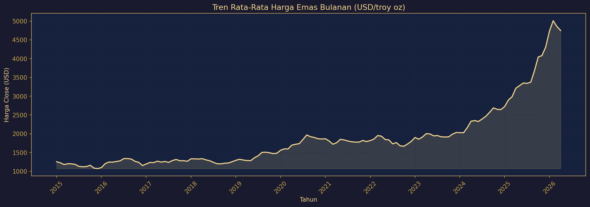
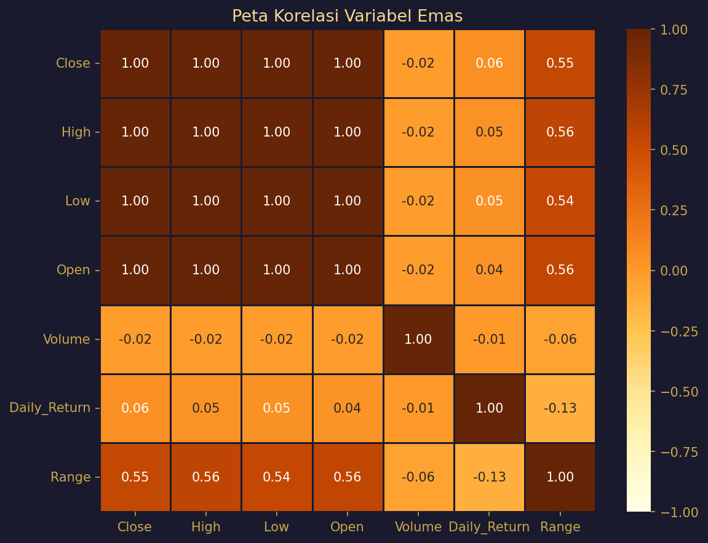
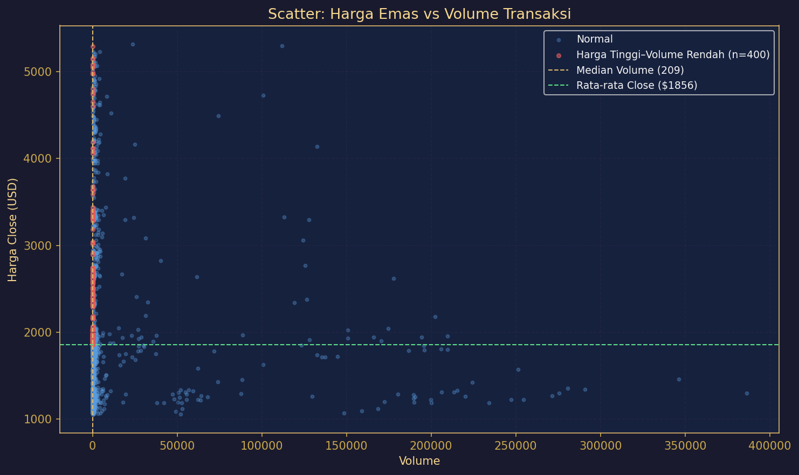
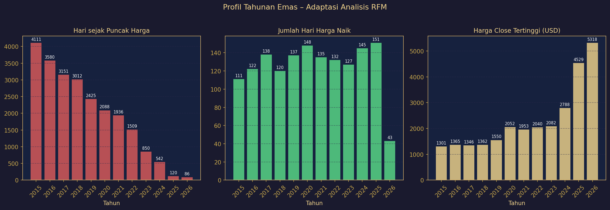
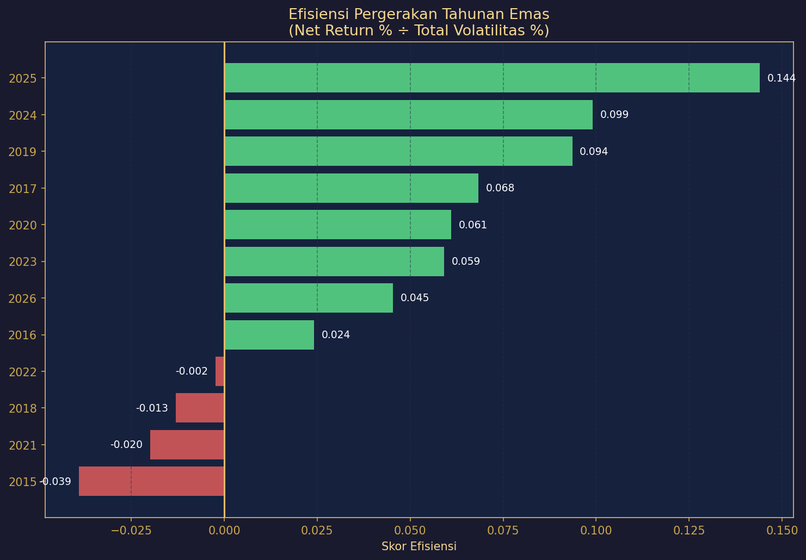
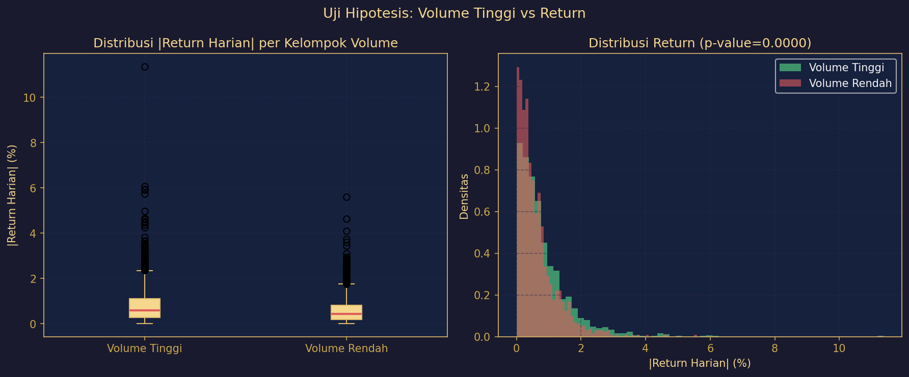
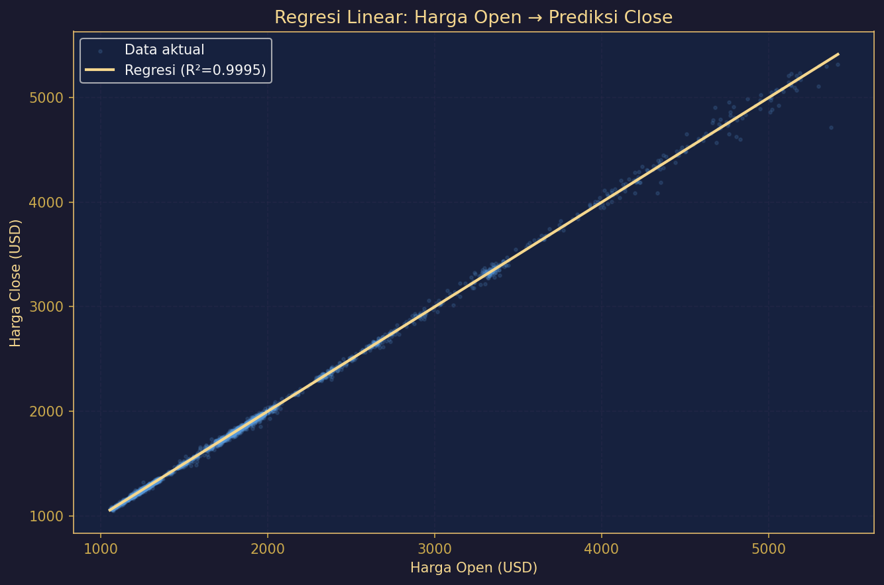

# 📊 Analisis Harga Emas (2015–2026)

Proyek ini menganalisis data harga emas dunia (Gold Futures GC=F) dari Yahoo Finance menggunakan Python. Tujuannya sederhana: **memahami pola harga emas dan apa yang bisa kita pelajari dari data tersebut.**

---

## 🗂️ Dataset
- **Sumber:** Yahoo Finance — Gold Futures (GC=F)
- **Periode:** Januari 2015 – April 2026
- **Jumlah data:** 2.843 hari perdagangan
- **Kolom:** Open, High, Low, Close, Volume

---

## 1. ❓ Business Question

Pertanyaan yang ingin dijawab dari data ini:

- Bagaimana tren harga emas selama 11 tahun terakhir?
- Faktor apa yang paling berpengaruh terhadap harga?
- Kapan waktu terbaik untuk berinvestasi emas?
- Apakah volume transaksi tinggi membuat harga lebih bergejolak?
- Bisakah kita memprediksi harga penutupan dari harga pembukaan?

---

## 2. 🔧 Data Wrangling

Data dari Yahoo Finance punya format header dua baris yang tidak langsung bisa dibaca. Ini yang dilakukan sebelum analisis:

```python
# Baca file dengan multi-level header
df = pd.read_csv('data/Gold_Data.csv', header=[0, 1], index_col=0)

# Sederhanakan nama kolom
df.columns = ['Close', 'High', 'Low', 'Open', 'Volume']

# Ubah index jadi format tanggal
df.index = pd.to_datetime(df.index)

# Tambah kolom baru untuk analisis
df['Daily_Return'] = df['Close'].pct_change() * 100  # persentase naik/turun harian
df['Range']        = df['High'] - df['Low']          # rentang harga dalam sehari
```

Hasilnya: data bersih, tidak ada nilai kosong, siap dianalisis.

---

## 3. 📈 Insights

### Grafik 1 — Tren Harga Emas Bulanan


Harga emas naik dari sekitar **$1.100 (2015)** menjadi **$5.318 (2026)** — kenaikan lebih dari 400% dalam 11 tahun. Lonjakan besar pertama terjadi di 2020 saat pandemi COVID-19, lalu akselerasi makin kencang mulai 2024. Ini menunjukkan emas semakin dilirik sebagai aset pelindung nilai.

---

### Grafik 2 — Heatmap Korelasi


- **Open, High, Low, Close** saling berkorelasi sempurna (1.00) — wajar karena semuanya harga di hari yang sama.
- **Volume hampir tidak berkorelasi (-0.02)** dengan harga → ramai atau sepinya transaksi tidak menentukan harga emas naik atau turun.
- **Range (volatilitas harian)** cukup berkorelasi dengan harga (0.55) → semakin mahal emas, semakin besar fluktuasinya dalam sehari.

---

### Grafik 3 — Scatter: Harga vs Volume


**400 hari** (titik merah) mencatat harga di atas rata-rata tapi volume di bawah normal. Artinya, **harga emas yang tinggi justru sering terjadi saat pasar sepi.** Ini berbeda dari saham — harga emas lebih dipengaruhi oleh kondisi global (inflasi, perang, krisis) bukan seberapa banyak orang trading hari itu.

---

### Grafik 4 — Profil Tahunan (Adaptasi RFM)


Setiap tahun dinilai berdasarkan 3 hal: seberapa baru puncak harganya, berapa hari harga naik, dan seberapa tinggi harga tertingginya.

| Tahun Terbaik 🥇 | Tahun Kuat 🥈 | Tahun Lemah 📉 |
|-----------------|--------------|---------------|
| 2020, 2024, 2025 | 2021, 2022, 2023 | 2015, 2016, 2018 |

**2025 jadi juara** — 151 hari naik dari ~252 hari perdagangan, harga tembus $4.529.

---

### Grafik 5 — Efisiensi Pergerakan Tahunan


Efisiensi = seberapa "terarah" harga naik dibanding total gejolaknya. **Skor hijau = untung, merah = rugi.**

- 🏆 **2025** paling efisien (0.144) — naik 64% dengan pergerakan yang konsisten.
- ❌ **2015** paling buruk (-0.039) — banyak bergerak tapi ujungnya malah turun 10%.

---

### Grafik 6 — Uji Hipotesis: Volume vs Pergerakan Harga


**Pertanyaan:** Apakah hari dengan volume tinggi membuat harga lebih bergejolak?

| Kelompok | Rata-rata Pergerakan |
|----------|---------------------|
| Volume Tinggi | **0.83%** |
| Volume Rendah | **0.62%** |

**Jawabannya: Ya, terbukti secara statistik (p < 0.0001).** Saat banyak orang bertransaksi, harga memang bergerak lebih kencang — bisa naik tajam, bisa juga turun tajam.

---

### Grafik 7 — Regresi Linear: Open → Close


Model mampu memprediksi harga penutupan dari harga pembukaan dengan **akurasi 99.95% (R² = 0.9995)**. Grafiknya hampir membentuk garis lurus sempurna.

```
Rumus: Close ≈ 0.9987 × Open + 2.43
```

Artinya harga emas jarang bergerak jauh dari harga pembukaannya dalam satu hari — inilah yang membuat emas relatif "tenang" dibanding aset lain seperti saham atau kripto.

---

## 4. 💡 Recommendation

**Untuk investor jangka panjang:**
Tren 11 tahun membuktikan emas adalah aset yang konsisten naik. Strategi beli rutin (dollar-cost averaging) tetap relevan, terutama saat kondisi ekonomi global tidak pasti.

**Untuk trader harian:**
Perhatikan hari-hari dengan volume tinggi — itu sinyal bahwa harga akan bergerak lebih besar dari biasanya. Harga pembukaan juga bisa jadi acuan untuk menetapkan target harga penutupan.

**Untuk riset selanjutnya:**
Volume saja tidak cukup untuk memprediksi arah harga. Perlu ditambahkan data eksternal seperti nilai tukar dolar, suku bunga, atau indeks inflasi untuk hasil analisis yang lebih kuat.

---

## ⚙️ Cara Menjalankan

```bash
# Install library yang dibutuhkan
pip install pandas numpy matplotlib seaborn scikit-learn scipy

# Jalankan program
python main.py
```

---

*Dibuat untuk tugas praktikum Data Analytics — analisis data harga emas menggunakan Python.*
